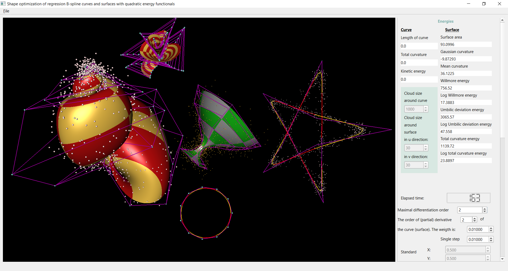

# Shape optimization of regression B-spline curves and surfaces with quadratic energy functionals

Author of thesis: Fazakas Edina-Szylvia

Coordinated by: Assoc. Prof. Dr. Ágoston Róth

This program is part of the final examination for bachelor degree studies at Faculty of Mathematics and Computer Sience, Babeș-Bolyai University Cluj-Napoca.

Abstract
--------

Least squares regression curves and surfaces are commonly used to approximate the shape of disordered noisy point clouds, in order to study phenomena related to Statistics, Geometric Modeling, Physics,
Astronomy, Artificial Intelligence or Numerical Analysis.
For the approximation of detailed point clouds, regression curves and surfaces are usually described
by basis functions providing local deformation, such as normalized polynomial B-spline basis functions
determined by a not necessarily uniform knot vector, which are also used to generate non-uniform rational B-spline curves/surfaces used as the de facto standard in current Computer-Aided Geometric Design
systems.
Using the attached OpenGL-, OpenMP-, Qt SDK- and C++-based, hardware-accelerated, multithreaded, platform-independent and interactive application, we not only produced classical regression
B-spline curves and surfaces that approximate disordered noisy point clouds, but we have also optimized/beautified their shape, by minimizing the weighted sum of additional quadratic energy functionals
that depend on the total squared length variation of first- and higher-order (partial) derivatives defined
along the regression curves/surfaces that have to be generated.

Pre-compiled Windows binaries
-----------------------------
You can run the pre-compiled Windows binary version of the application after
downloading it from the link:

https://github.com/FazakasEdina/Shape-optimization-of-regression-B-spline-curves-and-surfaces-with-quadratic-energy-functionals

Run-time requirements
---------------------
Windows 7+

Multi-core CPU

GPU that is compatible at least with OpenGL 3.0

Microsoft Visual C++ Redistributable Package for Visual Studio 2019

https://support.microsoft.com/en-us/topic/the-latest-supported-visual-c-downloads-2647da03-1eea-4433-9aff-95f26a218cc0

Compilation and IDE-based testing requirements for compiling/running the source of the project
------------------------------------------------------------------------------
Community Edition of Visual Studio 2019 (https://visualstudio.microsoft.com/vs/older-downloads/ or https://visualstudio.microsoft.com/thank-you-downloading-visual-studio/?sku=Community&rel=16)

Qt SDK Community Edition 6.2.3+ (http://download.qt.io/official_releases/online_installers/qt-unified-windows-x86-online.exe)

Windows SDK with only Debugging Tools for Windows (https://developer.microsoft.com/en-us/windows/downloads/windows-10-sdk/)

In order to run the application follow the next instructions
------------------------------------------------------------
Open the project in Qt Creator

Build the project in Release mode

There will be created a build folder next to the RegressionBSplineCurvesAndSurfaces folder

Copy the provided folders "Models", "Shaders", "B-spline models" and "Point clouds" into this build folder

Run the project

Test environments
-----------------
We have tested the application on a Windows 10 Pro-based PC with an Intel Core i5-8250U CPU
(@3.40GHz, 4 cores, 8 threads).

Contact
-------
If you require any further information, feel free to contact me.

Email: fazakasedina20@gmail.com
